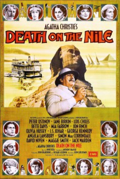

<!DOCTYPE html>
<html>
<head>
    <title>EMDB</title>
    <link href="emdb.css" rel="stylesheet" type="text/css" />
</head>
<body>
    

        

            Eric's Movie Database
            

                
                
                
                
            

        

        

            Letztes Update: 06.09.2021
            Anzahl Filme: 341
        

        

            <a href="#latest-additions" class="button-darkgray">Neueste Filme</a>
            <a href="#all-movies" class="button-darkgray">Alle Filme</a>
            <a href="#movies-a" class="button-darkgray">A</a>
<a href="#movies-b" class="button-darkgray">B</a>
<a href="#movies-c" class="button-darkgray">C</a>
<a href="#movies-d" class="button-darkgray">D</a>
<a href="#movies-e" class="button-darkgray">E</a>
<a href="#movies-f" class="button-darkgray">F</a>
<a href="#movies-g" class="button-darkgray">G</a>
<a href="#movies-h" class="button-darkgray">H</a>
<a href="#movies-i" class="button-darkgray">I</a>
<a href="#movies-j" class="button-darkgray">J</a>
<a href="#movies-k" class="button-darkgray">K</a>
<a href="#movies-l" class="button-darkgray">L</a>
<a href="#movies-m" class="button-darkgray">M</a>
<a href="#movies-n" class="button-darkgray">N</a>
<a href="#movies-o" class="button-darkgray">O</a>
<a href="#movies-p" class="button-darkgray">P</a>
<a href="#movies-q" class="button-darkgray">Q</a>
<a href="#movies-r" class="button-darkgray">R</a>
<a href="#movies-s" class="button-darkgray">S</a>
<a href="#movies-t" class="button-darkgray">T</a>
<a href="#movies-u" class="button-darkgray">U</a>
<a href="#movies-v" class="button-darkgray">V</a>
<a href="#movies-w" class="button-darkgray">W</a>
<a href="#movies-x" class="button-darkgray">X</a>
<a href="#movies-y" class="button-darkgray">Y</a>
<a href="#movies-z" class="button-darkgray">Z</a>

            <a href="#movies-09" class="button-darkgray">0..9</a>
            <a href="#movies-other" class="button-darkgray">Andere</a>
            <a href="#movies-3d" class="button-darkgray">3D</a>
            <a href="./genres/genres.html" class="button-darkgray">Genres</a>
            <a href="./years.html" class="button-darkgray">Jahre</a>
        

        
        

            Neueste Filme
        

        

        <ul class="link-gray movie-list">
            <li class="thumbnail">
    <a href="movies/341.html">
        

            
            

        

        

            Die Jagd&nbsp;&nbsp;(2012)
        

    </a>
</li>
<li class="thumbnail">
    <a href="movies/340.html">
        

            
            

        

        

            Stolz und Vorurteil & Zombies&nbsp;&nbsp;(2016)
        

    </a>
</li>
<li class="thumbnail">
    <a href="movies/339.html">
        

            
            

        

        

            American Psycho&nbsp;&nbsp;(2000)
        

    </a>
</li>
<li class="thumbnail">
    <a href="movies/338.html">
        

            
            

        

        

            Der Hauptmann&nbsp;&nbsp;(2017)
        

    </a>
</li>
<li class="thumbnail">
    <a href="movies/337.html">
        

            
            

        

        

            Jumanji: The Next Level&nbsp;&nbsp;(2019)
        

    </a>
</li>
<li class="thumbnail">
    <a href="movies/336.html">
        

            
            

        

        

            Raw&nbsp;&nbsp;(2016)
        

    </a>
</li>
<li class="thumbnail">
    <a href="movies/335.html">
        

            
            

        

        

            Das B&#246;se unter der Sonne&nbsp;&nbsp;(1982)
        

    </a>
</li>
<li class="thumbnail">
    <a href="movies/334.html">
        

            
            

        

        

            Tod auf dem Nil&nbsp;&nbsp;(1978)
        

    </a>
</li>
<li class="thumbnail">
    <a href="movies/333.html">
        

            
            

        

        

            Mord im Orient-Express&nbsp;&nbsp;(1974)
        

    </a>
</li>
<li class="thumbnail">
    <a href="movies/332.html">
        

            
            

        

        

            Lost Highway&nbsp;&nbsp;(1997)
        

    </a>
</li>
<li class="thumbnail">
    <a href="movies/331.html">
        

            
            

        

        

            Tenet&nbsp;&nbsp;(2020)
        

    </a>
</li>
<li class="thumbnail">
    <a href="movies/330.html">
        

            
            

        

        

            Fedora&nbsp;&nbsp;(1978)
        

    </a>
</li>

        </ul>
        

        

        
        

            Alle Filme
        

        

            <a href="#top" class="phone-home">HOME</a>
        

        <ul class="link-gray movie-list">
            <li><a href="movies/341.html">341.&nbsp;&nbsp;Die Jagd&nbsp;&nbsp;(2012)</a></li>
<li><a href="movies/340.html">340.&nbsp;&nbsp;Stolz und Vorurteil & Zombies&nbsp;&nbsp;(2016)</a></li>
<li><a href="movies/339.html">339.&nbsp;&nbsp;American Psycho&nbsp;&nbsp;(2000)</a></li>
<li><a href="movies/338.html">338.&nbsp;&nbsp;Der Hauptmann&nbsp;&nbsp;(2017)</a></li>
<li><a href="movies/337.html">337.&nbsp;&nbsp;Jumanji: The Next Level&nbsp;&nbsp;(2019)</a></li>
<li><a href="movies/336.html">336.&nbsp;&nbsp;Raw&nbsp;&nbsp;(2016)</a></li>
<li><a href="movies/335.html">335.&nbsp;&nbsp;Das B&#246;se unter der Sonne&nbsp;&nbsp;(1982)</a></li>
<li><a href="movies/334.html">334.&nbsp;&nbsp;Tod auf dem Nil&nbsp;&nbsp;(1978)</a></li>
<li><a href="movies/333.html">333.&nbsp;&nbsp;Mord im Orient-Express&nbsp;&nbsp;(1974)</a></li>
<li><a href="movies/332.html">332.&nbsp;&nbsp;Lost Highway&nbsp;&nbsp;(1997)</a></li>
<li><a href="movies/331.html">331.&nbsp;&nbsp;Tenet&nbsp;&nbsp;(2020)</a></li>
<li><a href="movies/330.html">330.&nbsp;&nbsp;Fedora&nbsp;&nbsp;(1978)</a></li>
<li><a href="movies/329.html">329.&nbsp;&nbsp;Midsommar&nbsp;&nbsp;(2019)</a></li>
<li><a href="movies/328.html">328.&nbsp;&nbsp;The Farewell&nbsp;&nbsp;(2019)</a></li>
<li><a href="movies/327.html">327.&nbsp;&nbsp;Booksmart&nbsp;&nbsp;(2019)</a></li>
<li><a href="movies/326.html">326.&nbsp;&nbsp;Dirty Dancing&nbsp;&nbsp;(1987)</a></li>
<li><a href="movies/325.html">325.&nbsp;&nbsp;Gef&#228;hrliche Brandung&nbsp;&nbsp;(1991)</a></li>
<li><a href="movies/324.html">324.&nbsp;&nbsp;12 Monkeys&nbsp;&nbsp;(1995)</a></li>
<li><a href="movies/323.html">323.&nbsp;&nbsp;Knives Out: Mord ist Familiensache&nbsp;&nbsp;(2019)</a></li>
<li><a href="movies/322.html">322.&nbsp;&nbsp;The Cabin in the Woods&nbsp;&nbsp;(2011)</a></li>
<li><a href="movies/321.html">321.&nbsp;&nbsp;The Peanut Butter Falcon&nbsp;&nbsp;(2019)</a></li>
<li><a href="movies/320.html">320.&nbsp;&nbsp;Das doppelte Lottchen&nbsp;&nbsp;(2017)</a></li>
<li><a href="movies/319.html">319.&nbsp;&nbsp;Stargate&nbsp;&nbsp;(1994)</a></li>
<li><a href="movies/318.html">318.&nbsp;&nbsp;A Quiet Place&nbsp;&nbsp;(2018)</a></li>
<li><a href="movies/317.html">317.&nbsp;&nbsp;Nocturnal Animals&nbsp;&nbsp;(2016)</a></li>
<li><a href="movies/316.html">316.&nbsp;&nbsp;Ad Astra: Zu den Sternen&nbsp;&nbsp;(2019)</a></li>
<li><a href="movies/315.html">315.&nbsp;&nbsp;Die Farbe aus dem All&nbsp;&nbsp;(2019)</a></li>
<li><a href="movies/314.html">314.&nbsp;&nbsp;Joker&nbsp;&nbsp;(2019)</a></li>
<li><a href="movies/313.html">313.&nbsp;&nbsp;The Gentlemen&nbsp;&nbsp;(2019)</a></li>
<li><a href="movies/312.html">312.&nbsp;&nbsp;Big Little Lies&nbsp;&nbsp;(2017)</a></li>
<li><a href="movies/311.html">311.&nbsp;&nbsp;Oldboy&nbsp;&nbsp;(2003)</a></li>
<li><a href="movies/310.html">310.&nbsp;&nbsp;Highlander - Es kann nur einen geben&nbsp;&nbsp;(1986)</a></li>
<li><a href="movies/309.html">309.&nbsp;&nbsp;Spider-Man: A New Universe&nbsp;&nbsp;(2018)</a></li>
<li><a href="movies/308.html">308.&nbsp;&nbsp;John Wick: Kapitel 3&nbsp;&nbsp;(2019)</a></li>
<li><a href="movies/307.html">307.&nbsp;&nbsp;Lethal Weapon 4 - Zwei Profis r&#228;umen auf&nbsp;&nbsp;(1998)</a></li>
<li><a href="movies/306.html">306.&nbsp;&nbsp;Brennpunkt L.A. - Die Profis sind zur&#252;ck&nbsp;&nbsp;(1992)</a></li>
<li><a href="movies/305.html">305.&nbsp;&nbsp;Lethal Weapon 2 - Brennpunkt L.A.&nbsp;&nbsp;(1989)</a></li>
<li><a href="movies/304.html">304.&nbsp;&nbsp;Lethal Weapon - Zwei stahlharte Profis&nbsp;&nbsp;(1987)</a></li>
<li><a href="movies/303.html">303.&nbsp;&nbsp;Parasite&nbsp;&nbsp;(2019)</a></li>
<li><a href="movies/302.html">302.&nbsp;&nbsp;Victoria&nbsp;&nbsp;(2015)</a></li>
<li><a href="movies/301.html">301.&nbsp;&nbsp;Die Stunde der Patrioten&nbsp;&nbsp;(1992)</a></li>
<li><a href="movies/300.html">300.&nbsp;&nbsp;Alles eine Frage der Zeit&nbsp;&nbsp;(2013)</a></li>
<li><a href="movies/299.html">299.&nbsp;&nbsp;The Witch&nbsp;&nbsp;(2015)</a></li>
<li><a href="movies/298.html">298.&nbsp;&nbsp;Vice: Der zweite Mann&nbsp;&nbsp;(2018)</a></li>
<li><a href="movies/297.html">297.&nbsp;&nbsp;The Accountant&nbsp;&nbsp;(2016)</a></li>
<li><a href="movies/296.html">296.&nbsp;&nbsp;Das f&#252;nfte Element&nbsp;&nbsp;(1997)</a></li>
<li><a href="movies/295.html">295.&nbsp;&nbsp;Under the Silver Lake&nbsp;&nbsp;(2018)</a></li>
<li><a href="movies/294.html">294.&nbsp;&nbsp;Shape of Water: Das Fl&#252;stern des Wassers&nbsp;&nbsp;(2017)</a></li>
<li><a href="movies/293.html">293.&nbsp;&nbsp;Scharade&nbsp;&nbsp;(1963)</a></li>
<li><a href="movies/292.html">292.&nbsp;&nbsp;Baby Driver&nbsp;&nbsp;(2017)</a></li>
<li><a href="movies/291.html">291.&nbsp;&nbsp;Call Me by Your Name&nbsp;&nbsp;(2017)</a></li>
<li><a href="movies/290.html">290.&nbsp;&nbsp;Attack the Block&nbsp;&nbsp;(2011)</a></li>
<li><a href="movies/289.html">289.&nbsp;&nbsp;Jumanji: Willkommen im Dschungel&nbsp;&nbsp;(2017)</a></li>
<li><a href="movies/288.html">288.&nbsp;&nbsp;The Favourite - Intrigen und Irrsinn&nbsp;&nbsp;(2018)</a></li>
<li><a href="movies/287.html">287.&nbsp;&nbsp;Bad Times at the El Royale&nbsp;&nbsp;(2018)</a></li>
<li><a href="movies/286.html">286.&nbsp;&nbsp;Bohemian Rhapsody&nbsp;&nbsp;(2018)</a></li>
<li><a href="movies/285.html">285.&nbsp;&nbsp;Clerks - Die Ladenh&#252;ter&nbsp;&nbsp;(1994)</a></li>
<li><a href="movies/284.html">284.&nbsp;&nbsp;Game Night&nbsp;&nbsp;(2018)</a></li>
<li><a href="movies/283.html">283.&nbsp;&nbsp;No Way Out: Gegen die Flammen&nbsp;&nbsp;(2017)</a></li>
<li><a href="movies/282.html">282.&nbsp;&nbsp;Smallfoot - Ein eisigartiges Abenteuer&nbsp;&nbsp;(2018)</a></li>
<li><a href="movies/281.html">281.&nbsp;&nbsp;Die Erfindung der Wahrheit&nbsp;&nbsp;(2016)</a></li>
<li><a href="movies/280.html">280.&nbsp;&nbsp;The Handmaid's Tale: Der Report der Magd&nbsp;&nbsp;(2017)</a></li>
<li><a href="movies/279.html">279.&nbsp;&nbsp;The Wicker Man&nbsp;&nbsp;(1973)</a></li>
<li><a href="movies/278.html">278.&nbsp;&nbsp;Kingsman: The Golden Circle&nbsp;&nbsp;(2017)</a></li>
<li><a href="movies/277.html">277.&nbsp;&nbsp;Three Billboards Outside Ebbing, Missouri&nbsp;&nbsp;(2017)</a></li>
<li><a href="movies/276.html">276.&nbsp;&nbsp;Red Sparrow&nbsp;&nbsp;(2018)</a></li>
<li><a href="movies/275.html">275.&nbsp;&nbsp;Fluch der Karibik&nbsp;&nbsp;(2003)</a></li>
<li><a href="movies/274.html">274.&nbsp;&nbsp;Jurassic Park&nbsp;&nbsp;(1993)</a></li>
<li><a href="movies/273.html">273.&nbsp;&nbsp;Bumblebee&nbsp;&nbsp;(2018)</a></li>
<li><a href="movies/272.html">272.&nbsp;&nbsp;BlacKkKlansman&nbsp;&nbsp;(2018)</a></li>
<li><a href="movies/271.html">271.&nbsp;&nbsp;Ostwind 3 - Aufbruch nach Ora&nbsp;&nbsp;(2017)</a></li>
<li><a href="movies/270.html">270.&nbsp;&nbsp;Jumanji&nbsp;&nbsp;(1995)</a></li>
<li><a href="movies/269.html">269.&nbsp;&nbsp;Don't Breathe&nbsp;&nbsp;(2016)</a></li>
<li><a href="movies/268.html">268.&nbsp;&nbsp;Nur Gott kann mich richten&nbsp;&nbsp;(2017)</a></li>
<li><a href="movies/267.html">267.&nbsp;&nbsp;Die Truman Show&nbsp;&nbsp;(1998)</a></li>
<li><a href="movies/266.html">266.&nbsp;&nbsp;...und t&#228;glich gr&#252;&#223;t das Murmeltier&nbsp;&nbsp;(1993)</a></li>
<li><a href="movies/265.html">265.&nbsp;&nbsp;Schlaflos in Seattle&nbsp;&nbsp;(1993)</a></li>
<li><a href="movies/264.html">264.&nbsp;&nbsp;Good Will Hunting - Der gute Will Hunting&nbsp;&nbsp;(1997)</a></li>
<li><a href="movies/263.html">263.&nbsp;&nbsp;Fear and Loathing in Las Vegas&nbsp;&nbsp;(1998)</a></li>
<li><a href="movies/262.html">262.&nbsp;&nbsp;La Femme Nikita&nbsp;&nbsp;(1990)</a></li>
<li><a href="movies/261.html">261.&nbsp;&nbsp;Total Recall: Die totale Erinnerung&nbsp;&nbsp;(1990)</a></li>
<li><a href="movies/260.html">260.&nbsp;&nbsp;Logan Lucky&nbsp;&nbsp;(2017)</a></li>
<li><a href="movies/259.html">259.&nbsp;&nbsp;Familiye&nbsp;&nbsp;(2017)</a></li>
<li><a href="movies/258.html">258.&nbsp;&nbsp;It Follows&nbsp;&nbsp;(2014)</a></li>
<li><a href="movies/257.html">257.&nbsp;&nbsp;Im Auftrag des Teufels&nbsp;&nbsp;(1997)</a></li>
<li><a href="movies/256.html">256.&nbsp;&nbsp;Die drei Tage des Condor&nbsp;&nbsp;(1975)</a></li>
<li><a href="movies/255.html">255.&nbsp;&nbsp;Basic Instinct&nbsp;&nbsp;(1992)</a></li>
<li><a href="movies/254.html">254.&nbsp;&nbsp;Bad Boys - Harte Jungs&nbsp;&nbsp;(1995)</a></li>
<li><a href="movies/253.html">253.&nbsp;&nbsp;Im Land der Raketen-W&#252;rmer&nbsp;&nbsp;(1990)</a></li>
<li><a href="movies/252.html">252.&nbsp;&nbsp;Crank&nbsp;&nbsp;(2006)</a></li>
<li><a href="movies/251.html">251.&nbsp;&nbsp;Ostwind 2&nbsp;&nbsp;(2015)</a></li>
<li><a href="movies/250.html">250.&nbsp;&nbsp;Die Eisk&#246;nigin - V&#246;llig unverfroren&nbsp;&nbsp;(2013)</a></li>
<li><a href="movies/249.html">249.&nbsp;&nbsp;The Equalizer 2&nbsp;&nbsp;(2018)</a></li>
<li><a href="movies/248.html">248.&nbsp;&nbsp;Atomic Blonde&nbsp;&nbsp;(2017)</a></li>
<li><a href="movies/247.html">247.&nbsp;&nbsp;Star Trek: Beyond&nbsp;&nbsp;(2016)</a></li>
<li><a href="movies/246.html">246.&nbsp;&nbsp;Get Out&nbsp;&nbsp;(2017)</a></li>
<li><a href="movies/245.html">245.&nbsp;&nbsp;Barry Seal: Only in America&nbsp;&nbsp;(2017)</a></li>
<li><a href="movies/244.html">244.&nbsp;&nbsp;Fast & Furious 8&nbsp;&nbsp;(2017)</a></li>
<li><a href="movies/243.html">243.&nbsp;&nbsp;Fast & Furious 7&nbsp;&nbsp;(2015)</a></li>
<li><a href="movies/242.html">242.&nbsp;&nbsp;Fast & Furious 6&nbsp;&nbsp;(2013)</a></li>
<li><a href="movies/241.html">241.&nbsp;&nbsp;John Wick: Kapitel 2&nbsp;&nbsp;(2017)</a></li>
<li><a href="movies/240.html">240.&nbsp;&nbsp;Hereditary - Das Verm&#228;chtnis&nbsp;&nbsp;(2018)</a></li>
<li><a href="movies/239.html">239.&nbsp;&nbsp;Mission: Impossible - Fallout&nbsp;&nbsp;(2018)</a></li>
<li><a href="movies/238.html">238.&nbsp;&nbsp;The Equalizer&nbsp;&nbsp;(2014)</a></li>
<li><a href="movies/237.html">237.&nbsp;&nbsp;Cast Away - Verschollen&nbsp;&nbsp;(2000)</a></li>
<li><a href="movies/236.html">236.&nbsp;&nbsp;Ostwind - Zusammen sind wir frei&nbsp;&nbsp;(2013)</a></li>
<li><a href="movies/235.html">235.&nbsp;&nbsp;Terminator 2: Tag der Abrechnung&nbsp;&nbsp;(1991)</a></li>
<li><a href="movies/234.html">234.&nbsp;&nbsp;Eric Clapton: Life in 12 Bars&nbsp;&nbsp;(2017)</a></li>
<li><a href="movies/233.html">233.&nbsp;&nbsp;Planet der Affen: Survival&nbsp;&nbsp;(2017)</a></li>
<li><a href="movies/232.html">232.&nbsp;&nbsp;Terminator&nbsp;&nbsp;(1984)</a></li>
<li><a href="movies/231.html">231.&nbsp;&nbsp;Der Teufel tr&#228;gt Prada&nbsp;&nbsp;(2006)</a></li>
<li><a href="movies/230.html">230.&nbsp;&nbsp;Wind River&nbsp;&nbsp;(2017)</a></li>
<li><a href="movies/229.html">229.&nbsp;&nbsp;Prestige - Die Meister der Magie&nbsp;&nbsp;(2006)</a></li>
<li><a href="movies/228.html">228.&nbsp;&nbsp;Casino&nbsp;&nbsp;(1995)</a></li>
<li><a href="movies/227.html">227.&nbsp;&nbsp;Blade Runner 2049&nbsp;&nbsp;(2017)</a></li>
<li><a href="movies/226.html">226.&nbsp;&nbsp;Conjuring 2&nbsp;&nbsp;(2016)</a></li>
<li><a href="movies/225.html">225.&nbsp;&nbsp;Dante's Peak&nbsp;&nbsp;(1997)</a></li>
<li><a href="movies/224.html">224.&nbsp;&nbsp;The Big Short&nbsp;&nbsp;(2015)</a></li>
<li><a href="movies/223.html">223.&nbsp;&nbsp;10 Cloverfield Lane&nbsp;&nbsp;(2016)</a></li>
<li><a href="movies/222.html">222.&nbsp;&nbsp;Gesetz der Rache&nbsp;&nbsp;(2009)</a></li>
<li><a href="movies/221.html">221.&nbsp;&nbsp;Raum&nbsp;&nbsp;(2015)</a></li>
<li><a href="movies/220.html">220.&nbsp;&nbsp;Arrival&nbsp;&nbsp;(2016)</a></li>
<li><a href="movies/219.html">219.&nbsp;&nbsp;Passengers&nbsp;&nbsp;(2016)</a></li>
<li><a href="movies/218.html">218.&nbsp;&nbsp;Kingsman: The Secret Service&nbsp;&nbsp;(2014)</a></li>
<li><a href="movies/217.html">217.&nbsp;&nbsp;La La Land&nbsp;&nbsp;(2016)</a></li>
<li><a href="movies/216.html">216.&nbsp;&nbsp;Logan: The Wolverine&nbsp;&nbsp;(2017)</a></li>
<li><a href="movies/215.html">215.&nbsp;&nbsp;Manchester by the Sea&nbsp;&nbsp;(2016)</a></li>
<li><a href="movies/214.html">214.&nbsp;&nbsp;Die Sopranos&nbsp;&nbsp;(1999)</a></li>
<li><a href="movies/213.html">213.&nbsp;&nbsp;Das doppelte Lottchen&nbsp;&nbsp;(1950)</a></li>
<li><a href="movies/212.html">212.&nbsp;&nbsp;The Big Lebowski&nbsp;&nbsp;(1998)</a></li>
<li><a href="movies/211.html">211.&nbsp;&nbsp;&#220;ber den D&#228;chern von Nizza&nbsp;&nbsp;(1955)</a></li>
<li><a href="movies/210.html">210.&nbsp;&nbsp;Stolz & Vorurteil&nbsp;&nbsp;(2005)</a></li>
<li><a href="movies/209.html">209.&nbsp;&nbsp;Shining&nbsp;&nbsp;(1980)</a></li>
<li><a href="movies/208.html">208.&nbsp;&nbsp;Im Netz der Spinne&nbsp;&nbsp;(2001)</a></li>
<li><a href="movies/207.html">207.&nbsp;&nbsp;Denn zum K&#252;ssen sind sie da&nbsp;&nbsp;(1997)</a></li>
<li><a href="movies/206.html">206.&nbsp;&nbsp;The Imitation Game - Ein streng geheimes Leben&nbsp;&nbsp;(2014)</a></li>
<li><a href="movies/205.html">205.&nbsp;&nbsp;Die Katze auf dem hei&#223;en Blechdach&nbsp;&nbsp;(1958)</a></li>
<li><a href="movies/204.html">204.&nbsp;&nbsp;La Isla minima - M&#246;rderland&nbsp;&nbsp;(2014)</a></li>
<li><a href="movies/203.html">203.&nbsp;&nbsp;Der Nachtmahr&nbsp;&nbsp;(2015)</a></li>
<li><a href="movies/202.html">202.&nbsp;&nbsp;The Neon Demon&nbsp;&nbsp;(2016)</a></li>
<li><a href="movies/201.html">201.&nbsp;&nbsp;Rambo&nbsp;&nbsp;(1982)</a></li>
<li><a href="movies/200.html">200.&nbsp;&nbsp;Midnight in Paris&nbsp;&nbsp;(2011)</a></li>
<li><a href="movies/199.html">199.&nbsp;&nbsp;Ex Machina&nbsp;&nbsp;(2015)</a></li>
<li><a href="movies/198.html">198.&nbsp;&nbsp;Sicario&nbsp;&nbsp;(2015)</a></li>
<li><a href="movies/197.html">197.&nbsp;&nbsp;2 Guns&nbsp;&nbsp;(2013)</a></li>
<li><a href="movies/196.html">196.&nbsp;&nbsp;Der Marsianer - Rettet Mark Watney&nbsp;&nbsp;(2015)</a></li>
<li><a href="movies/195.html">195.&nbsp;&nbsp;Deadpool&nbsp;&nbsp;(2016)</a></li>
<li><a href="movies/194.html">194.&nbsp;&nbsp;The Revenant - Der R&#252;ckkehrer&nbsp;&nbsp;(2015)</a></li>
<li><a href="movies/193.html">193.&nbsp;&nbsp;Meuterei auf der Bounty&nbsp;&nbsp;(1962)</a></li>
<li><a href="movies/192.html">192.&nbsp;&nbsp;Poltergeist&nbsp;&nbsp;(1982)</a></li>
<li><a href="movies/191.html">191.&nbsp;&nbsp;Blind Side - Die gro&#223;e Chance&nbsp;&nbsp;(2009)</a></li>
<li><a href="movies/190.html">190.&nbsp;&nbsp;Mad Max 2 - Der Vollstrecker&nbsp;&nbsp;(1981)</a></li>
<li><a href="movies/189.html">189.&nbsp;&nbsp;Lola rennt&nbsp;&nbsp;(1998)</a></li>
<li><a href="movies/188.html">188.&nbsp;&nbsp;From Paris with Love&nbsp;&nbsp;(2010)</a></li>
<li><a href="movies/187.html">187.&nbsp;&nbsp;James Bond 007 - Im Geheimdienst Ihrer Majest&#228;t&nbsp;&nbsp;(1969)</a></li>
<li><a href="movies/186.html">186.&nbsp;&nbsp;James Bond 007 - Feuerball&nbsp;&nbsp;(1965)</a></li>
<li><a href="movies/185.html">185.&nbsp;&nbsp;James Bond 007 - Goldfinger&nbsp;&nbsp;(1964)</a></li>
<li><a href="movies/184.html">184.&nbsp;&nbsp;James Bond 007 - Liebesgr&#252;&#223;e aus Moskau&nbsp;&nbsp;(1963)</a></li>
<li><a href="movies/183.html">183.&nbsp;&nbsp;James Bond 007 jagt Dr. No&nbsp;&nbsp;(1962)</a></li>
<li><a href="movies/182.html">182.&nbsp;&nbsp;Keinohrhasen&nbsp;&nbsp;(2007)</a></li>
<li><a href="movies/181.html">181.&nbsp;&nbsp;Tucker & Dale gegen das B&#246;se&nbsp;&nbsp;(2010)</a></li>
<li><a href="movies/180.html">180.&nbsp;&nbsp;Speed&nbsp;&nbsp;(1994)</a></li>
<li><a href="movies/179.html">179.&nbsp;&nbsp;e-m@il f&#252;r Dich&nbsp;&nbsp;(1998)</a></li>
<li><a href="movies/178.html">178.&nbsp;&nbsp;Fletchers Visionen&nbsp;&nbsp;(1997)</a></li>
<li><a href="movies/177.html">177.&nbsp;&nbsp;American Hustle&nbsp;&nbsp;(2013)</a></li>
<li><a href="movies/176.html">176.&nbsp;&nbsp;Prisoners&nbsp;&nbsp;(2013)</a></li>
<li><a href="movies/175.html">175.&nbsp;&nbsp;Escape Plan&nbsp;&nbsp;(2013)</a></li>
<li><a href="movies/174.html">174.&nbsp;&nbsp;Oblivion&nbsp;&nbsp;(2013)</a></li>
<li><a href="movies/173.html">173.&nbsp;&nbsp;Man lernt nie aus&nbsp;&nbsp;(2015)</a></li>
<li><a href="movies/172.html">172.&nbsp;&nbsp;Codename U.N.C.L.E.&nbsp;&nbsp;(2015)</a></li>
<li><a href="movies/171.html">171.&nbsp;&nbsp;Butterfly Effect&nbsp;&nbsp;(2004)</a></li>
<li><a href="movies/170.html">170.&nbsp;&nbsp;Indiana Jones und der letzte Kreuzzug&nbsp;&nbsp;(1989)</a></li>
<li><a href="movies/169.html">169.&nbsp;&nbsp;Indiana Jones und der Tempel des Todes&nbsp;&nbsp;(1984)</a></li>
<li><a href="movies/168.html">168.&nbsp;&nbsp;J&#228;ger des verlorenen Schatzes&nbsp;&nbsp;(1981)</a></li>
<li><a href="movies/167.html">167.&nbsp;&nbsp;Sabrina&nbsp;&nbsp;(1954)</a></li>
<li><a href="movies/166.html">166.&nbsp;&nbsp;Mission: Impossible&nbsp;&nbsp;(1996)</a></li>
<li><a href="movies/165.html">165.&nbsp;&nbsp;Das Geschenk seines Lebens&nbsp;&nbsp;(1997)</a></li>
<li><a href="movies/164.html">164.&nbsp;&nbsp;John Wick&nbsp;&nbsp;(2014)</a></li>
<li><a href="movies/163.html">163.&nbsp;&nbsp;Mission: Impossible - Rogue Nation&nbsp;&nbsp;(2015)</a></li>
<li><a href="movies/162.html">162.&nbsp;&nbsp;Match Point&nbsp;&nbsp;(2005)</a></li>
<li><a href="movies/161.html">161.&nbsp;&nbsp;Der verbotene Schl&#252;ssel&nbsp;&nbsp;(2005)</a></li>
<li><a href="movies/160.html">160.&nbsp;&nbsp;Einfach zu haben&nbsp;&nbsp;(2010)</a></li>
<li><a href="movies/159.html">159.&nbsp;&nbsp;Zodiac - Die Spur des Killers&nbsp;&nbsp;(2007)</a></li>
<li><a href="movies/158.html">158.&nbsp;&nbsp;American History X&nbsp;&nbsp;(1998)</a></li>
<li><a href="movies/157.html">157.&nbsp;&nbsp;Interview mit einem Vampir&nbsp;&nbsp;(1994)</a></li>
<li><a href="movies/156.html">156.&nbsp;&nbsp;Eine Frage der Ehre&nbsp;&nbsp;(1992)</a></li>
<li><a href="movies/155.html">155.&nbsp;&nbsp;2012 - Das Ende der Welt&nbsp;&nbsp;(2009)</a></li>
<li><a href="movies/154.html">154.&nbsp;&nbsp;White House Down&nbsp;&nbsp;(2013)</a></li>
<li><a href="movies/153.html">153.&nbsp;&nbsp;Stand by Me - Das Geheimnis eines Sommers&nbsp;&nbsp;(1986)</a></li>
<li><a href="movies/152.html">152.&nbsp;&nbsp;Lawrence von Arabien&nbsp;&nbsp;(1962)</a></li>
<li><a href="movies/151.html">151.&nbsp;&nbsp;Die Br&#252;cke am Kwai&nbsp;&nbsp;(1957)</a></li>
<li><a href="movies/150.html">150.&nbsp;&nbsp;Die Jagd nach dem gr&#252;nen Diamanten&nbsp;&nbsp;(1984)</a></li>
<li><a href="movies/149.html">149.&nbsp;&nbsp;Die zw&#246;lf Geschworenen&nbsp;&nbsp;(1957)</a></li>
<li><a href="movies/148.html">148.&nbsp;&nbsp;Alien - Die Wiedergeburt&nbsp;&nbsp;(1997)</a></li>
<li><a href="movies/147.html">147.&nbsp;&nbsp;Alien 3&nbsp;&nbsp;(1992)</a></li>
<li><a href="movies/146.html">146.&nbsp;&nbsp;Alien II&nbsp;&nbsp;(1986)</a></li>
<li><a href="movies/145.html">145.&nbsp;&nbsp;Alien - Director's Cut&nbsp;&nbsp;(1979)</a></li>
<li><a href="movies/144.html">144.&nbsp;&nbsp;Star Wars: Das Erwachen der Macht&nbsp;&nbsp;(2015)</a></li>
<li><a href="movies/143.html">143.&nbsp;&nbsp;Mad Max: Fury Road&nbsp;&nbsp;(2015)</a></li>
<li><a href="movies/142.html">142.&nbsp;&nbsp;Superbad&nbsp;&nbsp;(2007)</a></li>
<li><a href="movies/141.html">141.&nbsp;&nbsp;Whiplash&nbsp;&nbsp;(2014)</a></li>
<li><a href="movies/140.html">140.&nbsp;&nbsp;Das Schicksal ist ein mieser Verr&#228;ter&nbsp;&nbsp;(2014)</a></li>
<li><a href="movies/139.html">139.&nbsp;&nbsp;Django Unchained&nbsp;&nbsp;(2012)</a></li>
<li><a href="movies/138.html">138.&nbsp;&nbsp;The Interview&nbsp;&nbsp;(2014)</a></li>
<li><a href="movies/137.html">137.&nbsp;&nbsp;Inglourious Basterds&nbsp;&nbsp;(2009)</a></li>
<li><a href="movies/136.html">136.&nbsp;&nbsp;Gone Girl - Das perfekte Opfer&nbsp;&nbsp;(2014)</a></li>
<li><a href="movies/135.html">135.&nbsp;&nbsp;Non-Stop&nbsp;&nbsp;(2014)</a></li>
<li><a href="movies/134.html">134.&nbsp;&nbsp;The Wolf of Wall Street&nbsp;&nbsp;(2013)</a></li>
<li><a href="movies/133.html">133.&nbsp;&nbsp;Planet der Affen: Revolution&nbsp;&nbsp;(2014)</a></li>
<li><a href="movies/132.html">132.&nbsp;&nbsp;World War Z&nbsp;&nbsp;(2013)</a></li>
<li><a href="movies/131.html">131.&nbsp;&nbsp;Die etwas anderen Cops&nbsp;&nbsp;(2010)</a></li>
<li><a href="movies/130.html">130.&nbsp;&nbsp;Die Entf&#252;hrung der U-Bahn Pelham 1 2 3&nbsp;&nbsp;(2009)</a></li>
<li><a href="movies/129.html">129.&nbsp;&nbsp;Wer ist Hanna?&nbsp;&nbsp;(2011)</a></li>
<li><a href="movies/128.html">128.&nbsp;&nbsp;Nightcrawler - Jede Nacht hat ihren Preis&nbsp;&nbsp;(2014)</a></li>
<li><a href="movies/127.html">127.&nbsp;&nbsp;Hancock&nbsp;&nbsp;(2008)</a></li>
<li><a href="movies/126.html">126.&nbsp;&nbsp;James Bond 007 - Casino Royale&nbsp;&nbsp;(2006)</a></li>
<li><a href="movies/125.html">125.&nbsp;&nbsp;Das Bourne Verm&#228;chtnis&nbsp;&nbsp;(2012)</a></li>
<li><a href="movies/124.html">124.&nbsp;&nbsp;Das Bourne Ultimatum&nbsp;&nbsp;(2007)</a></li>
<li><a href="movies/123.html">123.&nbsp;&nbsp;Die Bourne Verschw&#246;rung&nbsp;&nbsp;(2004)</a></li>
<li><a href="movies/122.html">122.&nbsp;&nbsp;Die Bourne Identit&#228;t&nbsp;&nbsp;(2002)</a></li>
<li><a href="movies/121.html">121.&nbsp;&nbsp;Interstellar&nbsp;&nbsp;(2014)</a></li>
<li><a href="movies/120.html">120.&nbsp;&nbsp;True Detective&nbsp;&nbsp;(2014)</a></li>
<li><a href="movies/119.html">119.&nbsp;&nbsp;State of Play - Stand der Dinge&nbsp;&nbsp;(2009)</a></li>
<li><a href="movies/118.html">118.&nbsp;&nbsp;Veronica Mars&nbsp;&nbsp;(2014)</a></li>
<li><a href="movies/117.html">117.&nbsp;&nbsp;The Lego Movie&nbsp;&nbsp;(2014)</a></li>
<li><a href="movies/116.html">116.&nbsp;&nbsp;Last Samurai&nbsp;&nbsp;(2003)</a></li>
<li><a href="movies/115.html">115.&nbsp;&nbsp;Das erstaunliche Leben des Walter Mitty&nbsp;&nbsp;(2013)</a></li>
<li><a href="movies/114.html">114.&nbsp;&nbsp;Edge of Tomorrow&nbsp;&nbsp;(2014)</a></li>
<li><a href="movies/113.html">113.&nbsp;&nbsp;Ender's Game - Das gro&#223;e Spiel&nbsp;&nbsp;(2013)</a></li>
<li><a href="movies/112.html">112.&nbsp;&nbsp;Die Unfassbaren - Now You See Me&nbsp;&nbsp;(2013)</a></li>
<li><a href="movies/111.html">111.&nbsp;&nbsp;Conjuring - Die Heimsuchung&nbsp;&nbsp;(2013)</a></li>
<li><a href="movies/110.html">110.&nbsp;&nbsp;Evil Dead&nbsp;&nbsp;(2013)</a></li>
<li><a href="movies/109.html">109.&nbsp;&nbsp;Zombieland&nbsp;&nbsp;(2009)</a></li>
<li><a href="movies/108.html">108.&nbsp;&nbsp;American Beauty&nbsp;&nbsp;(1999)</a></li>
<li><a href="movies/107.html">107.&nbsp;&nbsp;Shutter Island&nbsp;&nbsp;(2010)</a></li>
<li><a href="movies/106.html">106.&nbsp;&nbsp;Catch Me If You Can&nbsp;&nbsp;(2002)</a></li>
<li><a href="movies/105.html">105.&nbsp;&nbsp;Gravity&nbsp;&nbsp;(2013)</a></li>
<li><a href="movies/104.html">104.&nbsp;&nbsp;Black Swan&nbsp;&nbsp;(2010)</a></li>
<li><a href="movies/103.html">103.&nbsp;&nbsp;Faster&nbsp;&nbsp;(2010)</a></li>
<li><a href="movies/102.html">102.&nbsp;&nbsp;Das gibt &#196;rger&nbsp;&nbsp;(2012)</a></li>
<li><a href="movies/101.html">101.&nbsp;&nbsp;Jumper&nbsp;&nbsp;(2008)</a></li>
<li><a href="movies/100.html">100.&nbsp;&nbsp;Source Code&nbsp;&nbsp;(2011)</a></li>
<li><a href="movies/99.html">99.&nbsp;&nbsp;Flight&nbsp;&nbsp;(2012)</a></li>
<li><a href="movies/98.html">98.&nbsp;&nbsp;Colombiana&nbsp;&nbsp;(2011)</a></li>
<li><a href="movies/97.html">97.&nbsp;&nbsp;Silver Linings&nbsp;&nbsp;(2012)</a></li>
<li><a href="movies/96.html">96.&nbsp;&nbsp;H&#228;nsel und Gretel: Hexenj&#228;ger&nbsp;&nbsp;(2013)</a></li>
<li><a href="movies/95.html">95.&nbsp;&nbsp;Star Trek: Into Darkness&nbsp;&nbsp;(2013)</a></li>
<li><a href="movies/94.html">94.&nbsp;&nbsp;Departed - Unter Feinden&nbsp;&nbsp;(2006)</a></li>
<li><a href="movies/93.html">93.&nbsp;&nbsp;L&#233;on - Der Profi&nbsp;&nbsp;(1994)</a></li>
<li><a href="movies/92.html">92.&nbsp;&nbsp;The Rock - Entscheidung auf Alcatraz&nbsp;&nbsp;(1996)</a></li>
<li><a href="movies/91.html">91.&nbsp;&nbsp;Get Smart&nbsp;&nbsp;(2008)</a></li>
<li><a href="movies/90.html">90.&nbsp;&nbsp;School of Rock&nbsp;&nbsp;(2003)</a></li>
<li><a href="movies/89.html">89.&nbsp;&nbsp;Misfits - Nicht gesellschaftsf&#228;hig&nbsp;&nbsp;(1961)</a></li>
<li><a href="movies/88.html">88.&nbsp;&nbsp;Manche m&#246;gen's hei&#223;&nbsp;&nbsp;(1959)</a></li>
<li><a href="movies/87.html">87.&nbsp;&nbsp;Das verflixte 7. Jahr&nbsp;&nbsp;(1955)</a></li>
<li><a href="movies/86.html">86.&nbsp;&nbsp;Rhythmus im Blut&nbsp;&nbsp;(1954)</a></li>
<li><a href="movies/85.html">85.&nbsp;&nbsp;Flu&#223; ohne Wiederkehr&nbsp;&nbsp;(1954)</a></li>
<li><a href="movies/84.html">84.&nbsp;&nbsp;Wie angelt man sich einen Million&#228;r&nbsp;&nbsp;(1953)</a></li>
<li><a href="movies/83.html">83.&nbsp;&nbsp;Blondinen bevorzugt&nbsp;&nbsp;(1953)</a></li>
<li><a href="movies/82.html">82.&nbsp;&nbsp;Man of Steel&nbsp;&nbsp;(2013)</a></li>
<li><a href="movies/81.html">81.&nbsp;&nbsp;Jack Reacher&nbsp;&nbsp;(2012)</a></li>
<li><a href="movies/80.html">80.&nbsp;&nbsp;Carrie - Des Satans j&#252;ngste Tochter&nbsp;&nbsp;(1976)</a></li>
<li><a href="movies/79.html">79.&nbsp;&nbsp;James Bond 007 - Skyfall&nbsp;&nbsp;(2012)</a></li>
<li><a href="movies/78.html">78.&nbsp;&nbsp;Prometheus - Dunkle Zeichen&nbsp;&nbsp;(2012)</a></li>
<li><a href="movies/77.html">77.&nbsp;&nbsp;American Gangster&nbsp;&nbsp;(2007)</a></li>
<li><a href="movies/76.html">76.&nbsp;&nbsp;Drag Me to Hell&nbsp;&nbsp;(2009)</a></li>
<li><a href="movies/75.html">75.&nbsp;&nbsp;Im Schatten des Zweifels&nbsp;&nbsp;(1943)</a></li>
<li><a href="movies/74.html">74.&nbsp;&nbsp;Kick-Ass&nbsp;&nbsp;(2010)</a></li>
<li><a href="movies/73.html">73.&nbsp;&nbsp;Das Ding aus einer anderen Welt&nbsp;&nbsp;(1982)</a></li>
<li><a href="movies/72.html">72.&nbsp;&nbsp;The Thing&nbsp;&nbsp;(2011)</a></li>
<li><a href="movies/71.html">71.&nbsp;&nbsp;Vertigo - Aus dem Reich der Toten&nbsp;&nbsp;(1958)</a></li>
<li><a href="movies/70.html">70.&nbsp;&nbsp;Die V&#246;gel&nbsp;&nbsp;(1963)</a></li>
<li><a href="movies/69.html">69.&nbsp;&nbsp;Das Fenster zum Hof&nbsp;&nbsp;(1954)</a></li>
<li><a href="movies/68.html">68.&nbsp;&nbsp;The Expendables 2&nbsp;&nbsp;(2012)</a></li>
<li><a href="movies/67.html">67.&nbsp;&nbsp;Auf der Jagd&nbsp;&nbsp;(1998)</a></li>
<li><a href="movies/66.html">66.&nbsp;&nbsp;Auf der Flucht&nbsp;&nbsp;(1993)</a></li>
<li><a href="movies/65.html">65.&nbsp;&nbsp;The Grey - Unter W&#246;lfen&nbsp;&nbsp;(2011)</a></li>
<li><a href="movies/64.html">64.&nbsp;&nbsp;Drive Angry&nbsp;&nbsp;(2011)</a></li>
<li><a href="movies/63.html">63.&nbsp;&nbsp;Drive&nbsp;&nbsp;(2011)</a></li>
<li><a href="movies/62.html">62.&nbsp;&nbsp;Der Blade Runner&nbsp;&nbsp;(1982)</a></li>
<li><a href="movies/61.html">61.&nbsp;&nbsp;Der unsichtbare Dritte&nbsp;&nbsp;(1959)</a></li>
<li><a href="movies/60.html">60.&nbsp;&nbsp;The Green Mile&nbsp;&nbsp;(1999)</a></li>
<li><a href="movies/59.html">59.&nbsp;&nbsp;Fight Club&nbsp;&nbsp;(1999)</a></li>
<li><a href="movies/58.html">58.&nbsp;&nbsp;Headhunters&nbsp;&nbsp;(2011)</a></li>
<li><a href="movies/57.html">57.&nbsp;&nbsp;The Amazing Spider-Man&nbsp;&nbsp;(2012)</a></li>
<li><a href="movies/56.html">56.&nbsp;&nbsp;Heat&nbsp;&nbsp;(1995)</a></li>
<li><a href="movies/55.html">55.&nbsp;&nbsp;Stirb langsam - Jetzt erst recht&nbsp;&nbsp;(1995)</a></li>
<li><a href="movies/54.html">54.&nbsp;&nbsp;Titanic&nbsp;&nbsp;(1997)</a></li>
<li><a href="movies/53.html">53.&nbsp;&nbsp;Pretty Woman&nbsp;&nbsp;(1990)</a></li>
<li><a href="movies/52.html">52.&nbsp;&nbsp;Braveheart&nbsp;&nbsp;(1995)</a></li>
<li><a href="movies/51.html">51.&nbsp;&nbsp;Contact&nbsp;&nbsp;(1997)</a></li>
<li><a href="movies/50.html">50.&nbsp;&nbsp;Batman Begins&nbsp;&nbsp;(2005)</a></li>
<li><a href="movies/49.html">49.&nbsp;&nbsp;Verblendung&nbsp;&nbsp;(2011)</a></li>
<li><a href="movies/48.html">48.&nbsp;&nbsp;Men in Black 3&nbsp;&nbsp;(2012)</a></li>
<li><a href="movies/47.html">47.&nbsp;&nbsp;Cowboys & Aliens&nbsp;&nbsp;(2011)</a></li>
<li><a href="movies/46.html">46.&nbsp;&nbsp;The Dark Knight Rises&nbsp;&nbsp;(2012)</a></li>
<li><a href="movies/45.html">45.&nbsp;&nbsp;Super 8&nbsp;&nbsp;(2011)</a></li>
<li><a href="movies/44.html">44.&nbsp;&nbsp;Mission: Impossible - Phantom Protokoll&nbsp;&nbsp;(2011)</a></li>
<li><a href="movies/43.html">43.&nbsp;&nbsp;Planet der Affen: Prevolution&nbsp;&nbsp;(2011)</a></li>
<li><a href="movies/42.html">42.&nbsp;&nbsp;D&#233;j&#224; Vu - Wettlauf gegen die Zeit&nbsp;&nbsp;(2006)</a></li>
<li><a href="movies/41.html">41.&nbsp;&nbsp;Slumdog Million&#228;r&nbsp;&nbsp;(2008)</a></li>
<li><a href="movies/40.html">40.&nbsp;&nbsp;Star Trek&nbsp;&nbsp;(2009)</a></li>
<li><a href="movies/39.html">39.&nbsp;&nbsp;Crazy, Stupid, Love.&nbsp;&nbsp;(2011)</a></li>
<li><a href="movies/38.html">38.&nbsp;&nbsp;96 Hours&nbsp;&nbsp;(2008)</a></li>
<li><a href="movies/37.html">37.&nbsp;&nbsp;Tats&#228;chlich... Liebe&nbsp;&nbsp;(2003)</a></li>
<li><a href="movies/36.html">36.&nbsp;&nbsp;True Grit - Vergeltung&nbsp;&nbsp;(2010)</a></li>
<li><a href="movies/35.html">35.&nbsp;&nbsp;Kill Bill: Vol. 1&nbsp;&nbsp;(2003)</a></li>
<li><a href="movies/34.html">34.&nbsp;&nbsp;X-Men 2&nbsp;&nbsp;(2003)</a></li>
<li><a href="movies/33.html">33.&nbsp;&nbsp;Kill Bill: Vol. 2&nbsp;&nbsp;(2004)</a></li>
<li><a href="movies/32.html">32.&nbsp;&nbsp;Gran Torino&nbsp;&nbsp;(2008)</a></li>
<li><a href="movies/31.html">31.&nbsp;&nbsp;Der Soldat James Ryan&nbsp;&nbsp;(1998)</a></li>
<li><a href="movies/30.html">30.&nbsp;&nbsp;X-Men&nbsp;&nbsp;(2000)</a></li>
<li><a href="movies/29.html">29.&nbsp;&nbsp;Stirb langsam 4.0&nbsp;&nbsp;(2007)</a></li>
<li><a href="movies/28.html">28.&nbsp;&nbsp;Fast & Furious Five&nbsp;&nbsp;(2011)</a></li>
<li><a href="movies/27.html">27.&nbsp;&nbsp;Ohne Limit&nbsp;&nbsp;(2011)</a></li>
<li><a href="movies/26.html">26.&nbsp;&nbsp;RocknRolla&nbsp;&nbsp;(2008)</a></li>
<li><a href="movies/25.html">25.&nbsp;&nbsp;Gladiator&nbsp;&nbsp;(2000)</a></li>
<li><a href="movies/24.html">24.&nbsp;&nbsp;John Rambo&nbsp;&nbsp;(2008)</a></li>
<li><a href="movies/23.html">23.&nbsp;&nbsp;Sin City&nbsp;&nbsp;(2005)</a></li>
<li><a href="movies/22.html">22.&nbsp;&nbsp;Sieben&nbsp;&nbsp;(1995)</a></li>
<li><a href="movies/21.html">21.&nbsp;&nbsp;R.E.D.: &#196;lter. H&#228;rter. Besser.&nbsp;&nbsp;(2010)</a></li>
<li><a href="movies/20.html">20.&nbsp;&nbsp;Troja&nbsp;&nbsp;(2004)</a></li>
<li><a href="movies/19.html">19.&nbsp;&nbsp;Machete&nbsp;&nbsp;(2010)</a></li>
<li><a href="movies/18.html">18.&nbsp;&nbsp;Shoot 'Em Up&nbsp;&nbsp;(2007)</a></li>
<li><a href="movies/17.html">17.&nbsp;&nbsp;Die Verurteilten&nbsp;&nbsp;(1994)</a></li>
<li><a href="movies/16.html">16.&nbsp;&nbsp;Die Insel&nbsp;&nbsp;(2005)</a></li>
<li><a href="movies/15.html">15.&nbsp;&nbsp;Der Herr der Ringe - Die zwei T&#252;rme&nbsp;&nbsp;(2002)</a></li>
<li><a href="movies/14.html">14.&nbsp;&nbsp;X-Men - Der letzte Widerstand&nbsp;&nbsp;(2006)</a></li>
<li><a href="movies/13.html">13.&nbsp;&nbsp;Forrest Gump&nbsp;&nbsp;(1994)</a></li>
<li><a href="movies/12.html">12.&nbsp;&nbsp;Absolute Power&nbsp;&nbsp;(1997)</a></li>
<li><a href="movies/11.html">11.&nbsp;&nbsp;16 Blocks&nbsp;&nbsp;(2006)</a></li>
<li><a href="movies/10.html">10.&nbsp;&nbsp;The Expendables&nbsp;&nbsp;(2010)</a></li>
<li><a href="movies/9.html">9.&nbsp;&nbsp;Inception&nbsp;&nbsp;(2010)</a></li>
<li><a href="movies/8.html">8.&nbsp;&nbsp;Salt&nbsp;&nbsp;(2010)</a></li>
<li><a href="movies/7.html">7.&nbsp;&nbsp;Der Herr der Ringe - Die Gef&#228;hrten&nbsp;&nbsp;(2001)</a></li>
<li><a href="movies/6.html">6.&nbsp;&nbsp;Der Herr der Ringe - Die R&#252;ckkehr des K&#246;nigs&nbsp;&nbsp;(2003)</a></li>
<li><a href="movies/5.html">5.&nbsp;&nbsp;The Dark Knight&nbsp;&nbsp;(2008)</a></li>
<li><a href="movies/4.html">4.&nbsp;&nbsp;Die Akte&nbsp;&nbsp;(1993)</a></li>
<li><a href="movies/3.html">3.&nbsp;&nbsp;Mamma Mia!&nbsp;&nbsp;(2008)</a></li>
<li><a href="movies/2.html">2.&nbsp;&nbsp;Cop Out - Geladen und entsichert&nbsp;&nbsp;(2010)</a></li>
<li><a href="movies/1.html">1.&nbsp;&nbsp;Sucker Punch&nbsp;&nbsp;(2011)</a></li>

        </ul>
        

        
        

            A
        

        

            <a href="#top" class="phone-home">HOME</a>
        

        <ul class="link-gray movie-list"><li><a href="movies/12.html">Absolute Power&nbsp;&nbsp;(1997)</a></li>
<li><a href="movies/297.html">The Accountant&nbsp;&nbsp;(2016)</a></li>
<li><a href="movies/316.html">Ad Astra: Zu den Sternen&nbsp;&nbsp;(2019)</a></li>
<li><a href="movies/148.html">Alien - Die Wiedergeburt&nbsp;&nbsp;(1997)</a></li>
<li><a href="movies/145.html">Alien - Director's Cut&nbsp;&nbsp;(1979)</a></li>
<li><a href="movies/147.html">Alien 3&nbsp;&nbsp;(1992)</a></li>
<li><a href="movies/146.html">Alien II&nbsp;&nbsp;(1986)</a></li>
<li><a href="movies/300.html">Alles eine Frage der Zeit&nbsp;&nbsp;(2013)</a></li>
<li><a href="movies/57.html">The Amazing Spider-Man&nbsp;&nbsp;(2012)</a></li>
<li><a href="movies/108.html">American Beauty&nbsp;&nbsp;(1999)</a></li>
<li><a href="movies/77.html">American Gangster&nbsp;&nbsp;(2007)</a></li>
<li><a href="movies/158.html">American History X&nbsp;&nbsp;(1998)</a></li>
<li><a href="movies/177.html">American Hustle&nbsp;&nbsp;(2013)</a></li>
<li><a href="movies/339.html">American Psycho&nbsp;&nbsp;(2000)</a></li>
<li><a href="movies/220.html">Arrival&nbsp;&nbsp;(2016)</a></li>
<li><a href="movies/248.html">Atomic Blonde&nbsp;&nbsp;(2017)</a></li>
<li><a href="movies/290.html">Attack the Block&nbsp;&nbsp;(2011)</a></li>
<li><a href="movies/66.html">Auf der Flucht&nbsp;&nbsp;(1993)</a></li>
<li><a href="movies/67.html">Auf der Jagd&nbsp;&nbsp;(1998)</a></li>
</ul>
        
        

            B
        

        

            <a href="#top" class="phone-home">HOME</a>
        

        <ul class="link-gray movie-list"><li><a href="movies/292.html">Baby Driver&nbsp;&nbsp;(2017)</a></li>
<li><a href="movies/254.html">Bad Boys - Harte Jungs&nbsp;&nbsp;(1995)</a></li>
<li><a href="movies/287.html">Bad Times at the El Royale&nbsp;&nbsp;(2018)</a></li>
<li><a href="movies/245.html">Barry Seal: Only in America&nbsp;&nbsp;(2017)</a></li>
<li><a href="movies/255.html">Basic Instinct&nbsp;&nbsp;(1992)</a></li>
<li><a href="movies/50.html">Batman Begins&nbsp;&nbsp;(2005)</a></li>
<li><a href="movies/212.html">The Big Lebowski&nbsp;&nbsp;(1998)</a></li>
<li><a href="movies/312.html">Big Little Lies&nbsp;&nbsp;(2017)</a></li>
<li><a href="movies/224.html">The Big Short&nbsp;&nbsp;(2015)</a></li>
<li><a href="movies/104.html">Black Swan&nbsp;&nbsp;(2010)</a></li>
<li><a href="movies/272.html">BlacKkKlansman&nbsp;&nbsp;(2018)</a></li>
<li><a href="movies/227.html">Blade Runner 2049&nbsp;&nbsp;(2017)</a></li>
<li><a href="movies/191.html">Blind Side - Die gro&#223;e Chance&nbsp;&nbsp;(2009)</a></li>
<li><a href="movies/83.html">Blondinen bevorzugt&nbsp;&nbsp;(1953)</a></li>
<li><a href="movies/286.html">Bohemian Rhapsody&nbsp;&nbsp;(2018)</a></li>
<li><a href="movies/327.html">Booksmart&nbsp;&nbsp;(2019)</a></li>
<li><a href="movies/52.html">Braveheart&nbsp;&nbsp;(1995)</a></li>
<li><a href="movies/306.html">Brennpunkt L.A. - Die Profis sind zur&#252;ck&nbsp;&nbsp;(1992)</a></li>
<li><a href="movies/273.html">Bumblebee&nbsp;&nbsp;(2018)</a></li>
<li><a href="movies/171.html">Butterfly Effect&nbsp;&nbsp;(2004)</a></li>
</ul>
        
        

            C
        

        

            <a href="#top" class="phone-home">HOME</a>
        

        <ul class="link-gray movie-list"><li><a href="movies/322.html">The Cabin in the Woods&nbsp;&nbsp;(2011)</a></li>
<li><a href="movies/291.html">Call Me by Your Name&nbsp;&nbsp;(2017)</a></li>
<li><a href="movies/80.html">Carrie - Des Satans j&#252;ngste Tochter&nbsp;&nbsp;(1976)</a></li>
<li><a href="movies/228.html">Casino&nbsp;&nbsp;(1995)</a></li>
<li><a href="movies/237.html">Cast Away - Verschollen&nbsp;&nbsp;(2000)</a></li>
<li><a href="movies/106.html">Catch Me If You Can&nbsp;&nbsp;(2002)</a></li>
<li><a href="movies/285.html">Clerks - Die Ladenh&#252;ter&nbsp;&nbsp;(1994)</a></li>
<li><a href="movies/172.html">Codename U.N.C.L.E.&nbsp;&nbsp;(2015)</a></li>
<li><a href="movies/98.html">Colombiana&nbsp;&nbsp;(2011)</a></li>
<li><a href="movies/111.html">Conjuring - Die Heimsuchung&nbsp;&nbsp;(2013)</a></li>
<li><a href="movies/226.html">Conjuring 2&nbsp;&nbsp;(2016)</a></li>
<li><a href="movies/51.html">Contact&nbsp;&nbsp;(1997)</a></li>
<li><a href="movies/2.html">Cop Out - Geladen und entsichert&nbsp;&nbsp;(2010)</a></li>
<li><a href="movies/47.html">Cowboys & Aliens&nbsp;&nbsp;(2011)</a></li>
<li><a href="movies/252.html">Crank&nbsp;&nbsp;(2006)</a></li>
<li><a href="movies/39.html">Crazy, Stupid, Love.&nbsp;&nbsp;(2011)</a></li>
</ul>
        
        

            D
        

        

            <a href="#top" class="phone-home">HOME</a>
        

        <ul class="link-gray movie-list"><li><a href="movies/225.html">Dante's Peak&nbsp;&nbsp;(1997)</a></li>
<li><a href="movies/5.html">The Dark Knight&nbsp;&nbsp;(2008)</a></li>
<li><a href="movies/46.html">The Dark Knight Rises&nbsp;&nbsp;(2012)</a></li>
<li><a href="movies/335.html">Das B&#246;se unter der Sonne&nbsp;&nbsp;(1982)</a></li>
<li><a href="movies/124.html">Das Bourne Ultimatum&nbsp;&nbsp;(2007)</a></li>
<li><a href="movies/125.html">Das Bourne Verm&#228;chtnis&nbsp;&nbsp;(2012)</a></li>
<li><a href="movies/73.html">Das Ding aus einer anderen Welt&nbsp;&nbsp;(1982)</a></li>
<li><a href="movies/213.html">Das doppelte Lottchen&nbsp;&nbsp;(1950)</a></li>
<li><a href="movies/320.html">Das doppelte Lottchen&nbsp;&nbsp;(2017)</a></li>
<li><a href="movies/115.html">Das erstaunliche Leben des Walter Mitty&nbsp;&nbsp;(2013)</a></li>
<li><a href="movies/69.html">Das Fenster zum Hof&nbsp;&nbsp;(1954)</a></li>
<li><a href="movies/296.html">Das f&#252;nfte Element&nbsp;&nbsp;(1997)</a></li>
<li><a href="movies/165.html">Das Geschenk seines Lebens&nbsp;&nbsp;(1997)</a></li>
<li><a href="movies/102.html">Das gibt &#196;rger&nbsp;&nbsp;(2012)</a></li>
<li><a href="movies/140.html">Das Schicksal ist ein mieser Verr&#228;ter&nbsp;&nbsp;(2014)</a></li>
<li><a href="movies/87.html">Das verflixte 7. Jahr&nbsp;&nbsp;(1955)</a></li>
<li><a href="movies/195.html">Deadpool&nbsp;&nbsp;(2016)</a></li>
<li><a href="movies/42.html">D&#233;j&#224; Vu - Wettlauf gegen die Zeit&nbsp;&nbsp;(2006)</a></li>
<li><a href="movies/207.html">Denn zum K&#252;ssen sind sie da&nbsp;&nbsp;(1997)</a></li>
<li><a href="movies/94.html">Departed - Unter Feinden&nbsp;&nbsp;(2006)</a></li>
<li><a href="movies/62.html">Der Blade Runner&nbsp;&nbsp;(1982)</a></li>
<li><a href="movies/338.html">Der Hauptmann&nbsp;&nbsp;(2017)</a></li>
<li><a href="movies/7.html">Der Herr der Ringe - Die Gef&#228;hrten&nbsp;&nbsp;(2001)</a></li>
<li><a href="movies/6.html">Der Herr der Ringe - Die R&#252;ckkehr des K&#246;nigs&nbsp;&nbsp;(2003)</a></li>
<li><a href="movies/15.html">Der Herr der Ringe - Die zwei T&#252;rme&nbsp;&nbsp;(2002)</a></li>
<li><a href="movies/196.html">Der Marsianer - Rettet Mark Watney&nbsp;&nbsp;(2015)</a></li>
<li><a href="movies/203.html">Der Nachtmahr&nbsp;&nbsp;(2015)</a></li>
<li><a href="movies/31.html">Der Soldat James Ryan&nbsp;&nbsp;(1998)</a></li>
<li><a href="movies/231.html">Der Teufel tr&#228;gt Prada&nbsp;&nbsp;(2006)</a></li>
<li><a href="movies/61.html">Der unsichtbare Dritte&nbsp;&nbsp;(1959)</a></li>
<li><a href="movies/161.html">Der verbotene Schl&#252;ssel&nbsp;&nbsp;(2005)</a></li>
<li><a href="movies/4.html">Die Akte&nbsp;&nbsp;(1993)</a></li>
<li><a href="movies/122.html">Die Bourne Identit&#228;t&nbsp;&nbsp;(2002)</a></li>
<li><a href="movies/123.html">Die Bourne Verschw&#246;rung&nbsp;&nbsp;(2004)</a></li>
<li><a href="movies/151.html">Die Br&#252;cke am Kwai&nbsp;&nbsp;(1957)</a></li>
<li><a href="movies/256.html">Die drei Tage des Condor&nbsp;&nbsp;(1975)</a></li>
<li><a href="movies/250.html">Die Eisk&#246;nigin - V&#246;llig unverfroren&nbsp;&nbsp;(2013)</a></li>
<li><a href="movies/130.html">Die Entf&#252;hrung der U-Bahn Pelham 1 2 3&nbsp;&nbsp;(2009)</a></li>
<li><a href="movies/281.html">Die Erfindung der Wahrheit&nbsp;&nbsp;(2016)</a></li>
<li><a href="movies/131.html">Die etwas anderen Cops&nbsp;&nbsp;(2010)</a></li>
<li><a href="movies/315.html">Die Farbe aus dem All&nbsp;&nbsp;(2019)</a></li>
<li><a href="movies/16.html">Die Insel&nbsp;&nbsp;(2005)</a></li>
<li><a href="movies/341.html">Die Jagd&nbsp;&nbsp;(2012)</a></li>
<li><a href="movies/150.html">Die Jagd nach dem gr&#252;nen Diamanten&nbsp;&nbsp;(1984)</a></li>
<li><a href="movies/205.html">Die Katze auf dem hei&#223;en Blechdach&nbsp;&nbsp;(1958)</a></li>
<li><a href="movies/214.html">Die Sopranos&nbsp;&nbsp;(1999)</a></li>
<li><a href="movies/301.html">Die Stunde der Patrioten&nbsp;&nbsp;(1992)</a></li>
<li><a href="movies/267.html">Die Truman Show&nbsp;&nbsp;(1998)</a></li>
<li><a href="movies/112.html">Die Unfassbaren - Now You See Me&nbsp;&nbsp;(2013)</a></li>
<li><a href="movies/17.html">Die Verurteilten&nbsp;&nbsp;(1994)</a></li>
<li><a href="movies/70.html">Die V&#246;gel&nbsp;&nbsp;(1963)</a></li>
<li><a href="movies/149.html">Die zw&#246;lf Geschworenen&nbsp;&nbsp;(1957)</a></li>
<li><a href="movies/326.html">Dirty Dancing&nbsp;&nbsp;(1987)</a></li>
<li><a href="movies/139.html">Django Unchained&nbsp;&nbsp;(2012)</a></li>
<li><a href="movies/269.html">Don't Breathe&nbsp;&nbsp;(2016)</a></li>
<li><a href="movies/76.html">Drag Me to Hell&nbsp;&nbsp;(2009)</a></li>
<li><a href="movies/63.html">Drive&nbsp;&nbsp;(2011)</a></li>
<li><a href="movies/64.html">Drive Angry&nbsp;&nbsp;(2011)</a></li>
</ul>
        
        

            E
        

        

            <a href="#top" class="phone-home">HOME</a>
        

        <ul class="link-gray movie-list"><li><a href="movies/114.html">Edge of Tomorrow&nbsp;&nbsp;(2014)</a></li>
<li><a href="movies/156.html">Eine Frage der Ehre&nbsp;&nbsp;(1992)</a></li>
<li><a href="movies/160.html">Einfach zu haben&nbsp;&nbsp;(2010)</a></li>
<li><a href="movies/179.html">e-m@il f&#252;r Dich&nbsp;&nbsp;(1998)</a></li>
<li><a href="movies/113.html">Ender's Game - Das gro&#223;e Spiel&nbsp;&nbsp;(2013)</a></li>
<li><a href="movies/238.html">The Equalizer&nbsp;&nbsp;(2014)</a></li>
<li><a href="movies/249.html">The Equalizer 2&nbsp;&nbsp;(2018)</a></li>
<li><a href="movies/234.html">Eric Clapton: Life in 12 Bars&nbsp;&nbsp;(2017)</a></li>
<li><a href="movies/175.html">Escape Plan&nbsp;&nbsp;(2013)</a></li>
<li><a href="movies/110.html">Evil Dead&nbsp;&nbsp;(2013)</a></li>
<li><a href="movies/199.html">Ex Machina&nbsp;&nbsp;(2015)</a></li>
<li><a href="movies/10.html">The Expendables&nbsp;&nbsp;(2010)</a></li>
<li><a href="movies/68.html">The Expendables 2&nbsp;&nbsp;(2012)</a></li>
</ul>
        
        

            F
        

        

            <a href="#top" class="phone-home">HOME</a>
        

        <ul class="link-gray movie-list"><li><a href="movies/259.html">Familiye&nbsp;&nbsp;(2017)</a></li>
<li><a href="movies/328.html">The Farewell&nbsp;&nbsp;(2019)</a></li>
<li><a href="movies/242.html">Fast & Furious 6&nbsp;&nbsp;(2013)</a></li>
<li><a href="movies/243.html">Fast & Furious 7&nbsp;&nbsp;(2015)</a></li>
<li><a href="movies/244.html">Fast & Furious 8&nbsp;&nbsp;(2017)</a></li>
<li><a href="movies/28.html">Fast & Furious Five&nbsp;&nbsp;(2011)</a></li>
<li><a href="movies/103.html">Faster&nbsp;&nbsp;(2010)</a></li>
<li><a href="movies/288.html">The Favourite - Intrigen und Irrsinn&nbsp;&nbsp;(2018)</a></li>
<li><a href="movies/263.html">Fear and Loathing in Las Vegas&nbsp;&nbsp;(1998)</a></li>
<li><a href="movies/330.html">Fedora&nbsp;&nbsp;(1978)</a></li>
<li><a href="movies/59.html">Fight Club&nbsp;&nbsp;(1999)</a></li>
<li><a href="movies/178.html">Fletchers Visionen&nbsp;&nbsp;(1997)</a></li>
<li><a href="movies/99.html">Flight&nbsp;&nbsp;(2012)</a></li>
<li><a href="movies/275.html">Fluch der Karibik&nbsp;&nbsp;(2003)</a></li>
<li><a href="movies/85.html">Flu&#223; ohne Wiederkehr&nbsp;&nbsp;(1954)</a></li>
<li><a href="movies/13.html">Forrest Gump&nbsp;&nbsp;(1994)</a></li>
<li><a href="movies/188.html">From Paris with Love&nbsp;&nbsp;(2010)</a></li>
</ul>
        
        

            G
        

        

            <a href="#top" class="phone-home">HOME</a>
        

        <ul class="link-gray movie-list"><li><a href="movies/284.html">Game Night&nbsp;&nbsp;(2018)</a></li>
<li><a href="movies/325.html">Gef&#228;hrliche Brandung&nbsp;&nbsp;(1991)</a></li>
<li><a href="movies/313.html">The Gentlemen&nbsp;&nbsp;(2019)</a></li>
<li><a href="movies/222.html">Gesetz der Rache&nbsp;&nbsp;(2009)</a></li>
<li><a href="movies/246.html">Get Out&nbsp;&nbsp;(2017)</a></li>
<li><a href="movies/91.html">Get Smart&nbsp;&nbsp;(2008)</a></li>
<li><a href="movies/25.html">Gladiator&nbsp;&nbsp;(2000)</a></li>
<li><a href="movies/136.html">Gone Girl - Das perfekte Opfer&nbsp;&nbsp;(2014)</a></li>
<li><a href="movies/264.html">Good Will Hunting - Der gute Will Hunting&nbsp;&nbsp;(1997)</a></li>
<li><a href="movies/32.html">Gran Torino&nbsp;&nbsp;(2008)</a></li>
<li><a href="movies/105.html">Gravity&nbsp;&nbsp;(2013)</a></li>
<li><a href="movies/60.html">The Green Mile&nbsp;&nbsp;(1999)</a></li>
<li><a href="movies/65.html">The Grey - Unter W&#246;lfen&nbsp;&nbsp;(2011)</a></li>
</ul>
        
        

            H
        

        

            <a href="#top" class="phone-home">HOME</a>
        

        <ul class="link-gray movie-list"><li><a href="movies/127.html">Hancock&nbsp;&nbsp;(2008)</a></li>
<li><a href="movies/280.html">The Handmaid's Tale: Der Report der Magd&nbsp;&nbsp;(2017)</a></li>
<li><a href="movies/96.html">H&#228;nsel und Gretel: Hexenj&#228;ger&nbsp;&nbsp;(2013)</a></li>
<li><a href="movies/58.html">Headhunters&nbsp;&nbsp;(2011)</a></li>
<li><a href="movies/56.html">Heat&nbsp;&nbsp;(1995)</a></li>
<li><a href="movies/240.html">Hereditary - Das Verm&#228;chtnis&nbsp;&nbsp;(2018)</a></li>
<li><a href="movies/310.html">Highlander - Es kann nur einen geben&nbsp;&nbsp;(1986)</a></li>
</ul>
        
        

            I
        

        

            <a href="#top" class="phone-home">HOME</a>
        

        <ul class="link-gray movie-list"><li><a href="movies/257.html">Im Auftrag des Teufels&nbsp;&nbsp;(1997)</a></li>
<li><a href="movies/253.html">Im Land der Raketen-W&#252;rmer&nbsp;&nbsp;(1990)</a></li>
<li><a href="movies/208.html">Im Netz der Spinne&nbsp;&nbsp;(2001)</a></li>
<li><a href="movies/75.html">Im Schatten des Zweifels&nbsp;&nbsp;(1943)</a></li>
<li><a href="movies/206.html">The Imitation Game - Ein streng geheimes Leben&nbsp;&nbsp;(2014)</a></li>
<li><a href="movies/9.html">Inception&nbsp;&nbsp;(2010)</a></li>
<li><a href="movies/170.html">Indiana Jones und der letzte Kreuzzug&nbsp;&nbsp;(1989)</a></li>
<li><a href="movies/169.html">Indiana Jones und der Tempel des Todes&nbsp;&nbsp;(1984)</a></li>
<li><a href="movies/137.html">Inglourious Basterds&nbsp;&nbsp;(2009)</a></li>
<li><a href="movies/121.html">Interstellar&nbsp;&nbsp;(2014)</a></li>
<li><a href="movies/138.html">The Interview&nbsp;&nbsp;(2014)</a></li>
<li><a href="movies/157.html">Interview mit einem Vampir&nbsp;&nbsp;(1994)</a></li>
<li><a href="movies/258.html">It Follows&nbsp;&nbsp;(2014)</a></li>
</ul>
        
        

            J
        

        

            <a href="#top" class="phone-home">HOME</a>
        

        <ul class="link-gray movie-list"><li><a href="movies/81.html">Jack Reacher&nbsp;&nbsp;(2012)</a></li>
<li><a href="movies/168.html">J&#228;ger des verlorenen Schatzes&nbsp;&nbsp;(1981)</a></li>
<li><a href="movies/126.html">James Bond 007 - Casino Royale&nbsp;&nbsp;(2006)</a></li>
<li><a href="movies/186.html">James Bond 007 - Feuerball&nbsp;&nbsp;(1965)</a></li>
<li><a href="movies/185.html">James Bond 007 - Goldfinger&nbsp;&nbsp;(1964)</a></li>
<li><a href="movies/187.html">James Bond 007 - Im Geheimdienst Ihrer Majest&#228;t&nbsp;&nbsp;(1969)</a></li>
<li><a href="movies/184.html">James Bond 007 - Liebesgr&#252;&#223;e aus Moskau&nbsp;&nbsp;(1963)</a></li>
<li><a href="movies/79.html">James Bond 007 - Skyfall&nbsp;&nbsp;(2012)</a></li>
<li><a href="movies/183.html">James Bond 007 jagt Dr. No&nbsp;&nbsp;(1962)</a></li>
<li><a href="movies/24.html">John Rambo&nbsp;&nbsp;(2008)</a></li>
<li><a href="movies/164.html">John Wick&nbsp;&nbsp;(2014)</a></li>
<li><a href="movies/241.html">John Wick: Kapitel 2&nbsp;&nbsp;(2017)</a></li>
<li><a href="movies/308.html">John Wick: Kapitel 3&nbsp;&nbsp;(2019)</a></li>
<li><a href="movies/314.html">Joker&nbsp;&nbsp;(2019)</a></li>
<li><a href="movies/270.html">Jumanji&nbsp;&nbsp;(1995)</a></li>
<li><a href="movies/337.html">Jumanji: The Next Level&nbsp;&nbsp;(2019)</a></li>
<li><a href="movies/289.html">Jumanji: Willkommen im Dschungel&nbsp;&nbsp;(2017)</a></li>
<li><a href="movies/101.html">Jumper&nbsp;&nbsp;(2008)</a></li>
<li><a href="movies/274.html">Jurassic Park&nbsp;&nbsp;(1993)</a></li>
</ul>
        
        

            K
        

        

            <a href="#top" class="phone-home">HOME</a>
        

        <ul class="link-gray movie-list"><li><a href="movies/182.html">Keinohrhasen&nbsp;&nbsp;(2007)</a></li>
<li><a href="movies/74.html">Kick-Ass&nbsp;&nbsp;(2010)</a></li>
<li><a href="movies/35.html">Kill Bill: Vol. 1&nbsp;&nbsp;(2003)</a></li>
<li><a href="movies/33.html">Kill Bill: Vol. 2&nbsp;&nbsp;(2004)</a></li>
<li><a href="movies/278.html">Kingsman: The Golden Circle&nbsp;&nbsp;(2017)</a></li>
<li><a href="movies/218.html">Kingsman: The Secret Service&nbsp;&nbsp;(2014)</a></li>
<li><a href="movies/323.html">Knives Out: Mord ist Familiensache&nbsp;&nbsp;(2019)</a></li>
</ul>
        
        

            L
        

        

            <a href="#top" class="phone-home">HOME</a>
        

        <ul class="link-gray movie-list"><li><a href="movies/262.html">La Femme Nikita&nbsp;&nbsp;(1990)</a></li>
<li><a href="movies/204.html">La Isla minima - M&#246;rderland&nbsp;&nbsp;(2014)</a></li>
<li><a href="movies/217.html">La La Land&nbsp;&nbsp;(2016)</a></li>
<li><a href="movies/116.html">Last Samurai&nbsp;&nbsp;(2003)</a></li>
<li><a href="movies/152.html">Lawrence von Arabien&nbsp;&nbsp;(1962)</a></li>
<li><a href="movies/117.html">The Lego Movie&nbsp;&nbsp;(2014)</a></li>
<li><a href="movies/93.html">L&#233;on - Der Profi&nbsp;&nbsp;(1994)</a></li>
<li><a href="movies/304.html">Lethal Weapon - Zwei stahlharte Profis&nbsp;&nbsp;(1987)</a></li>
<li><a href="movies/305.html">Lethal Weapon 2 - Brennpunkt L.A.&nbsp;&nbsp;(1989)</a></li>
<li><a href="movies/307.html">Lethal Weapon 4 - Zwei Profis r&#228;umen auf&nbsp;&nbsp;(1998)</a></li>
<li><a href="movies/260.html">Logan Lucky&nbsp;&nbsp;(2017)</a></li>
<li><a href="movies/216.html">Logan: The Wolverine&nbsp;&nbsp;(2017)</a></li>
<li><a href="movies/189.html">Lola rennt&nbsp;&nbsp;(1998)</a></li>
<li><a href="movies/332.html">Lost Highway&nbsp;&nbsp;(1997)</a></li>
</ul>
        
        

            M
        

        

            <a href="#top" class="phone-home">HOME</a>
        

        <ul class="link-gray movie-list"><li><a href="movies/19.html">Machete&nbsp;&nbsp;(2010)</a></li>
<li><a href="movies/190.html">Mad Max 2 - Der Vollstrecker&nbsp;&nbsp;(1981)</a></li>
<li><a href="movies/143.html">Mad Max: Fury Road&nbsp;&nbsp;(2015)</a></li>
<li><a href="movies/3.html">Mamma Mia!&nbsp;&nbsp;(2008)</a></li>
<li><a href="movies/173.html">Man lernt nie aus&nbsp;&nbsp;(2015)</a></li>
<li><a href="movies/82.html">Man of Steel&nbsp;&nbsp;(2013)</a></li>
<li><a href="movies/88.html">Manche m&#246;gen's hei&#223;&nbsp;&nbsp;(1959)</a></li>
<li><a href="movies/215.html">Manchester by the Sea&nbsp;&nbsp;(2016)</a></li>
<li><a href="movies/162.html">Match Point&nbsp;&nbsp;(2005)</a></li>
<li><a href="movies/48.html">Men in Black 3&nbsp;&nbsp;(2012)</a></li>
<li><a href="movies/193.html">Meuterei auf der Bounty&nbsp;&nbsp;(1962)</a></li>
<li><a href="movies/200.html">Midnight in Paris&nbsp;&nbsp;(2011)</a></li>
<li><a href="movies/329.html">Midsommar&nbsp;&nbsp;(2019)</a></li>
<li><a href="movies/89.html">Misfits - Nicht gesellschaftsf&#228;hig&nbsp;&nbsp;(1961)</a></li>
<li><a href="movies/166.html">Mission: Impossible&nbsp;&nbsp;(1996)</a></li>
<li><a href="movies/239.html">Mission: Impossible - Fallout&nbsp;&nbsp;(2018)</a></li>
<li><a href="movies/44.html">Mission: Impossible - Phantom Protokoll&nbsp;&nbsp;(2011)</a></li>
<li><a href="movies/163.html">Mission: Impossible - Rogue Nation&nbsp;&nbsp;(2015)</a></li>
<li><a href="movies/333.html">Mord im Orient-Express&nbsp;&nbsp;(1974)</a></li>
</ul>
        
        

            N
        

        

            <a href="#top" class="phone-home">HOME</a>
        

        <ul class="link-gray movie-list"><li><a href="movies/202.html">The Neon Demon&nbsp;&nbsp;(2016)</a></li>
<li><a href="movies/128.html">Nightcrawler - Jede Nacht hat ihren Preis&nbsp;&nbsp;(2014)</a></li>
<li><a href="movies/283.html">No Way Out: Gegen die Flammen&nbsp;&nbsp;(2017)</a></li>
<li><a href="movies/317.html">Nocturnal Animals&nbsp;&nbsp;(2016)</a></li>
<li><a href="movies/135.html">Non-Stop&nbsp;&nbsp;(2014)</a></li>
<li><a href="movies/268.html">Nur Gott kann mich richten&nbsp;&nbsp;(2017)</a></li>
</ul>
        
        

            O
        

        

            <a href="#top" class="phone-home">HOME</a>
        

        <ul class="link-gray movie-list"><li><a href="movies/174.html">Oblivion&nbsp;&nbsp;(2013)</a></li>
<li><a href="movies/27.html">Ohne Limit&nbsp;&nbsp;(2011)</a></li>
<li><a href="movies/311.html">Oldboy&nbsp;&nbsp;(2003)</a></li>
<li><a href="movies/236.html">Ostwind - Zusammen sind wir frei&nbsp;&nbsp;(2013)</a></li>
<li><a href="movies/251.html">Ostwind 2&nbsp;&nbsp;(2015)</a></li>
<li><a href="movies/271.html">Ostwind 3 - Aufbruch nach Ora&nbsp;&nbsp;(2017)</a></li>
</ul>
        
        

            P
        

        

            <a href="#top" class="phone-home">HOME</a>
        

        <ul class="link-gray movie-list"><li><a href="movies/303.html">Parasite&nbsp;&nbsp;(2019)</a></li>
<li><a href="movies/219.html">Passengers&nbsp;&nbsp;(2016)</a></li>
<li><a href="movies/321.html">The Peanut Butter Falcon&nbsp;&nbsp;(2019)</a></li>
<li><a href="movies/43.html">Planet der Affen: Prevolution&nbsp;&nbsp;(2011)</a></li>
<li><a href="movies/133.html">Planet der Affen: Revolution&nbsp;&nbsp;(2014)</a></li>
<li><a href="movies/233.html">Planet der Affen: Survival&nbsp;&nbsp;(2017)</a></li>
<li><a href="movies/192.html">Poltergeist&nbsp;&nbsp;(1982)</a></li>
<li><a href="movies/229.html">Prestige - Die Meister der Magie&nbsp;&nbsp;(2006)</a></li>
<li><a href="movies/53.html">Pretty Woman&nbsp;&nbsp;(1990)</a></li>
<li><a href="movies/176.html">Prisoners&nbsp;&nbsp;(2013)</a></li>
<li><a href="movies/78.html">Prometheus - Dunkle Zeichen&nbsp;&nbsp;(2012)</a></li>
</ul>
        
        

            Q
        

        

            <a href="#top" class="phone-home">HOME</a>
        

        <ul class="link-gray movie-list"><li><a href="movies/318.html">A Quiet Place&nbsp;&nbsp;(2018)</a></li>
</ul>
        
        

            R
        

        

            <a href="#top" class="phone-home">HOME</a>
        

        <ul class="link-gray movie-list"><li><a href="movies/21.html">R.E.D.: &#196;lter. H&#228;rter. Besser.&nbsp;&nbsp;(2010)</a></li>
<li><a href="movies/201.html">Rambo&nbsp;&nbsp;(1982)</a></li>
<li><a href="movies/221.html">Raum&nbsp;&nbsp;(2015)</a></li>
<li><a href="movies/336.html">Raw&nbsp;&nbsp;(2016)</a></li>
<li><a href="movies/276.html">Red Sparrow&nbsp;&nbsp;(2018)</a></li>
<li><a href="movies/194.html">The Revenant - Der R&#252;ckkehrer&nbsp;&nbsp;(2015)</a></li>
<li><a href="movies/86.html">Rhythmus im Blut&nbsp;&nbsp;(1954)</a></li>
<li><a href="movies/92.html">The Rock - Entscheidung auf Alcatraz&nbsp;&nbsp;(1996)</a></li>
<li><a href="movies/26.html">RocknRolla&nbsp;&nbsp;(2008)</a></li>
</ul>
        
        

            S
        

        

            <a href="#top" class="phone-home">HOME</a>
        

        <ul class="link-gray movie-list"><li><a href="movies/167.html">Sabrina&nbsp;&nbsp;(1954)</a></li>
<li><a href="movies/8.html">Salt&nbsp;&nbsp;(2010)</a></li>
<li><a href="movies/293.html">Scharade&nbsp;&nbsp;(1963)</a></li>
<li><a href="movies/265.html">Schlaflos in Seattle&nbsp;&nbsp;(1993)</a></li>
<li><a href="movies/90.html">School of Rock&nbsp;&nbsp;(2003)</a></li>
<li><a href="movies/294.html">Shape of Water: Das Fl&#252;stern des Wassers&nbsp;&nbsp;(2017)</a></li>
<li><a href="movies/209.html">Shining&nbsp;&nbsp;(1980)</a></li>
<li><a href="movies/18.html">Shoot 'Em Up&nbsp;&nbsp;(2007)</a></li>
<li><a href="movies/107.html">Shutter Island&nbsp;&nbsp;(2010)</a></li>
<li><a href="movies/198.html">Sicario&nbsp;&nbsp;(2015)</a></li>
<li><a href="movies/22.html">Sieben&nbsp;&nbsp;(1995)</a></li>
<li><a href="movies/97.html">Silver Linings&nbsp;&nbsp;(2012)</a></li>
<li><a href="movies/23.html">Sin City&nbsp;&nbsp;(2005)</a></li>
<li><a href="movies/41.html">Slumdog Million&#228;r&nbsp;&nbsp;(2008)</a></li>
<li><a href="movies/282.html">Smallfoot - Ein eisigartiges Abenteuer&nbsp;&nbsp;(2018)</a></li>
<li><a href="movies/100.html">Source Code&nbsp;&nbsp;(2011)</a></li>
<li><a href="movies/180.html">Speed&nbsp;&nbsp;(1994)</a></li>
<li><a href="movies/309.html">Spider-Man: A New Universe&nbsp;&nbsp;(2018)</a></li>
<li><a href="movies/153.html">Stand by Me - Das Geheimnis eines Sommers&nbsp;&nbsp;(1986)</a></li>
<li><a href="movies/40.html">Star Trek&nbsp;&nbsp;(2009)</a></li>
<li><a href="movies/247.html">Star Trek: Beyond&nbsp;&nbsp;(2016)</a></li>
<li><a href="movies/95.html">Star Trek: Into Darkness&nbsp;&nbsp;(2013)</a></li>
<li><a href="movies/144.html">Star Wars: Das Erwachen der Macht&nbsp;&nbsp;(2015)</a></li>
<li><a href="movies/319.html">Stargate&nbsp;&nbsp;(1994)</a></li>
<li><a href="movies/119.html">State of Play - Stand der Dinge&nbsp;&nbsp;(2009)</a></li>
<li><a href="movies/55.html">Stirb langsam - Jetzt erst recht&nbsp;&nbsp;(1995)</a></li>
<li><a href="movies/29.html">Stirb langsam 4.0&nbsp;&nbsp;(2007)</a></li>
<li><a href="movies/210.html">Stolz & Vorurteil&nbsp;&nbsp;(2005)</a></li>
<li><a href="movies/340.html">Stolz und Vorurteil & Zombies&nbsp;&nbsp;(2016)</a></li>
<li><a href="movies/1.html">Sucker Punch&nbsp;&nbsp;(2011)</a></li>
<li><a href="movies/45.html">Super 8&nbsp;&nbsp;(2011)</a></li>
<li><a href="movies/142.html">Superbad&nbsp;&nbsp;(2007)</a></li>
</ul>
        
        

            T
        

        

            <a href="#top" class="phone-home">HOME</a>
        

        <ul class="link-gray movie-list"><li><a href="movies/37.html">Tats&#228;chlich... Liebe&nbsp;&nbsp;(2003)</a></li>
<li><a href="movies/331.html">Tenet&nbsp;&nbsp;(2020)</a></li>
<li><a href="movies/232.html">Terminator&nbsp;&nbsp;(1984)</a></li>
<li><a href="movies/235.html">Terminator 2: Tag der Abrechnung&nbsp;&nbsp;(1991)</a></li>
<li><a href="movies/72.html">The Thing&nbsp;&nbsp;(2011)</a></li>
<li><a href="movies/277.html">Three Billboards Outside Ebbing, Missouri&nbsp;&nbsp;(2017)</a></li>
<li><a href="movies/54.html">Titanic&nbsp;&nbsp;(1997)</a></li>
<li><a href="movies/334.html">Tod auf dem Nil&nbsp;&nbsp;(1978)</a></li>
<li><a href="movies/261.html">Total Recall: Die totale Erinnerung&nbsp;&nbsp;(1990)</a></li>
<li><a href="movies/20.html">Troja&nbsp;&nbsp;(2004)</a></li>
<li><a href="movies/120.html">True Detective&nbsp;&nbsp;(2014)</a></li>
<li><a href="movies/36.html">True Grit - Vergeltung&nbsp;&nbsp;(2010)</a></li>
<li><a href="movies/181.html">Tucker & Dale gegen das B&#246;se&nbsp;&nbsp;(2010)</a></li>
</ul>
        
        

            U
        

        

            <a href="#top" class="phone-home">HOME</a>
        

        <ul class="link-gray movie-list"><li><a href="movies/211.html">&#220;ber den D&#228;chern von Nizza&nbsp;&nbsp;(1955)</a></li>
<li><a href="movies/295.html">Under the Silver Lake&nbsp;&nbsp;(2018)</a></li>
</ul>
        
        

            V
        

        

            <a href="#top" class="phone-home">HOME</a>
        

        <ul class="link-gray movie-list"><li><a href="movies/49.html">Verblendung&nbsp;&nbsp;(2011)</a></li>
<li><a href="movies/118.html">Veronica Mars&nbsp;&nbsp;(2014)</a></li>
<li><a href="movies/71.html">Vertigo - Aus dem Reich der Toten&nbsp;&nbsp;(1958)</a></li>
<li><a href="movies/298.html">Vice: Der zweite Mann&nbsp;&nbsp;(2018)</a></li>
<li><a href="movies/302.html">Victoria&nbsp;&nbsp;(2015)</a></li>
</ul>
        
        

            W
        

        

            <a href="#top" class="phone-home">HOME</a>
        

        <ul class="link-gray movie-list"><li><a href="movies/129.html">Wer ist Hanna?&nbsp;&nbsp;(2011)</a></li>
<li><a href="movies/141.html">Whiplash&nbsp;&nbsp;(2014)</a></li>
<li><a href="movies/154.html">White House Down&nbsp;&nbsp;(2013)</a></li>
<li><a href="movies/279.html">The Wicker Man&nbsp;&nbsp;(1973)</a></li>
<li><a href="movies/84.html">Wie angelt man sich einen Million&#228;r&nbsp;&nbsp;(1953)</a></li>
<li><a href="movies/230.html">Wind River&nbsp;&nbsp;(2017)</a></li>
<li><a href="movies/299.html">The Witch&nbsp;&nbsp;(2015)</a></li>
<li><a href="movies/134.html">The Wolf of Wall Street&nbsp;&nbsp;(2013)</a></li>
<li><a href="movies/132.html">World War Z&nbsp;&nbsp;(2013)</a></li>
</ul>
        
        

            X
        

        

            <a href="#top" class="phone-home">HOME</a>
        

        <ul class="link-gray movie-list"><li><a href="movies/30.html">X-Men&nbsp;&nbsp;(2000)</a></li>
<li><a href="movies/14.html">X-Men - Der letzte Widerstand&nbsp;&nbsp;(2006)</a></li>
<li><a href="movies/34.html">X-Men 2&nbsp;&nbsp;(2003)</a></li>
</ul>
        
        

            Z
        

        

            <a href="#top" class="phone-home">HOME</a>
        

        <ul class="link-gray movie-list"><li><a href="movies/159.html">Zodiac - Die Spur des Killers&nbsp;&nbsp;(2007)</a></li>
<li><a href="movies/109.html">Zombieland&nbsp;&nbsp;(2009)</a></li>
</ul>
        

        
        
0..9

        

            <a href="#top" class="phone-home">HOME</a>
        

        <ul class="link-gray movie-list"><li><a href="movies/197.html">2 Guns&nbsp;&nbsp;(2013)</a></li>
<li><a href="movies/223.html">10 Cloverfield Lane&nbsp;&nbsp;(2016)</a></li>
<li><a href="movies/324.html">12 Monkeys&nbsp;&nbsp;(1995)</a></li>
<li><a href="movies/11.html">16 Blocks&nbsp;&nbsp;(2006)</a></li>
<li><a href="movies/38.html">96 Hours&nbsp;&nbsp;(2008)</a></li>
<li><a href="movies/155.html">2012 - Das Ende der Welt&nbsp;&nbsp;(2009)</a></li>
</ul>
        

        
        

            Andere
        

        

            <a href="#top" class="phone-home">HOME</a>
        

        <ul class="link-gray movie-list"><li><a href="movies/266.html">...und t&#228;glich gr&#252;&#223;t das Murmeltier&nbsp;&nbsp;(1993)</a></li>
</ul>
        

        
        

            3D Movies
        

        

            <a href="#top" class="phone-home">HOME</a>
        

        <ul class="link-gray movie-list"></ul>
        

        

            
Erstellt mit EMDB V4.11 (C) 2005-2021. Keine Rechte vorbehalten ;-)

            
        

    

</body>
</html>